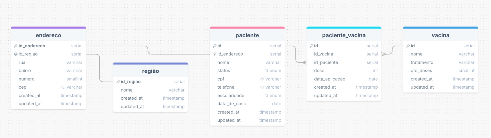

# Projeto Integrador

## Insomnia
Importe o arquivo insomnia.yaml para testar as rotas

## DB
- PostgreSQL
- Crie um database chamado `projeto_integrador_db`

## Tecnologias
- Java 17
- Spring Boot
- Flyway

## Modelo Lógico

## Instruções
- Para testar a api, rode a seed antes para preencher o banco de dados.